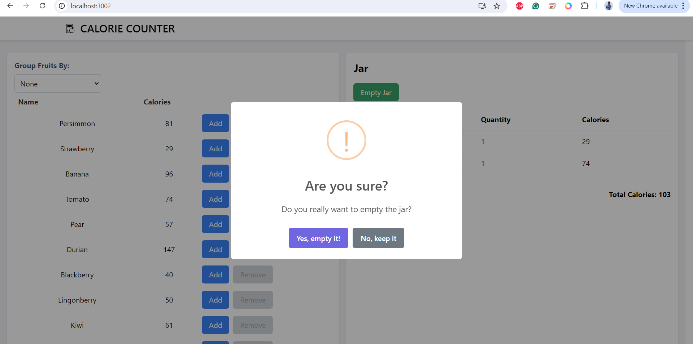
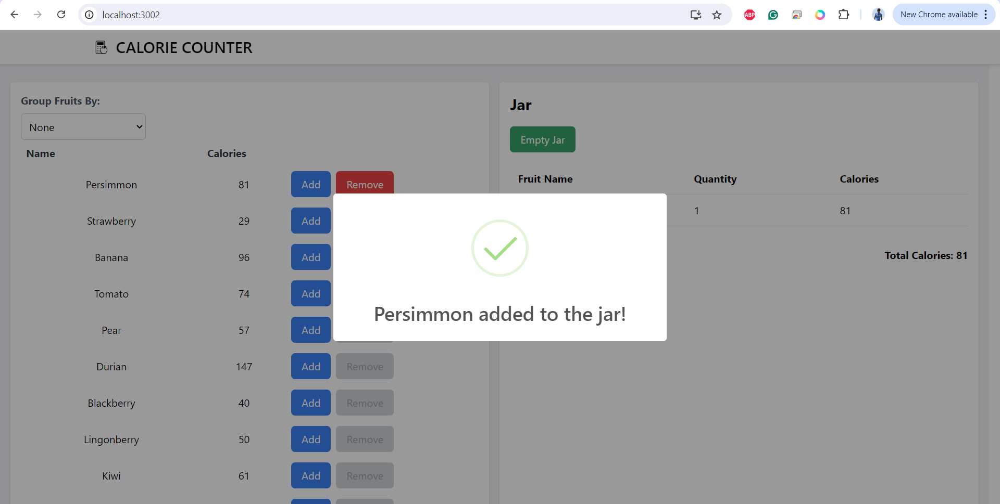
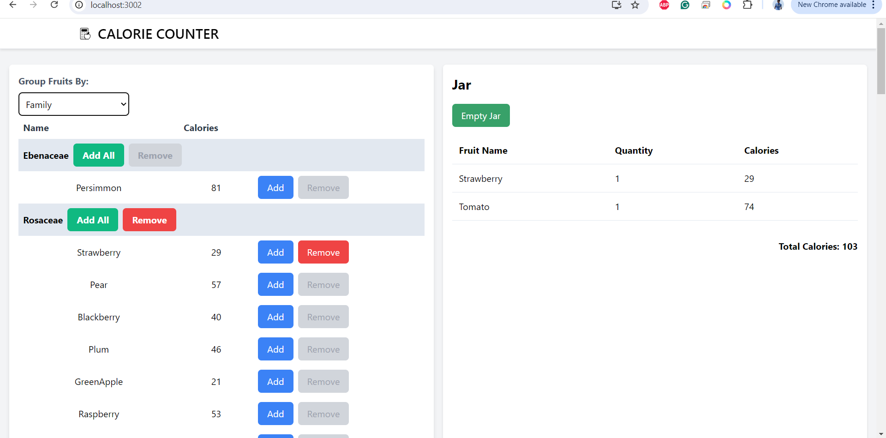
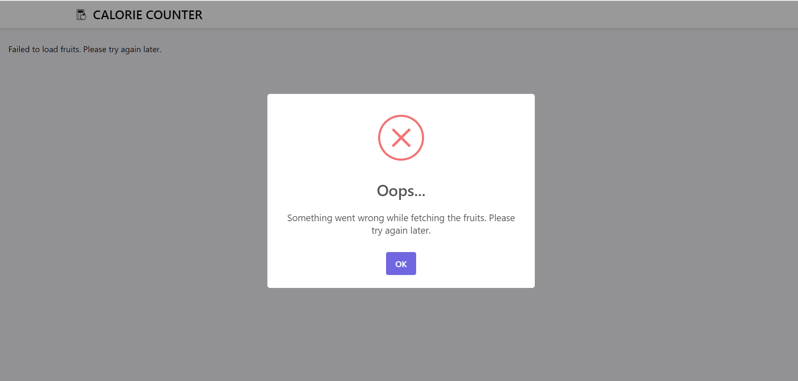
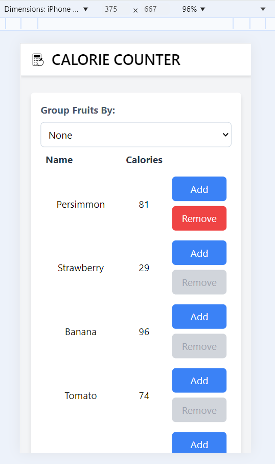

# Fruit Calorie Calculator

## Overview

The Fruit Calorie Calculator is a React and TypeScript application designed to display a list of fruits fetched from the Fruityvice API. The application allows users to group fruits by different categories (None, Family, Order, Genus) and add them to a "Jar" while calculating the total calories.

## Features

- **Data Fetching:** The application fetches a list of fruits from the Fruityvice API.
- **Grouping:** Users can group the list of fruits by Family, Order, or Genus.
- **Add to Jar:** Users can add individual fruits or entire groups to a jar.
- **Calorie Calculation:** The total calories in the jar are dynamically calculated and displayed.
- **Responsive Design:** The application is responsive and works well on different screen sizes.
- **Error Handling:** The app includes basic error handling for API requests.

## Test Cases

The application includes test cases to ensure that key functionalities work as expected. The tests are written using Jest and React Testing Library.

### Tests Include:
- **Adding a Fruit to the Jar:** Ensures that a fruit can be added to the jar and that the total calories update accordingly.
- **Emptying the Jar:** Tests the functionality of emptying the jar and checking if the jar is properly reset.

## Screenshots

*Figure 1: Fruit list and jar View.*


*Figure 2: Empty Jar Popup View.*


*Figure 3: Fruit Add Popup View.*


*Figure 4: Group By View.*


*Figure 5: Connection issue popup View.*


*Figure 6: Fruit List and  Jar Responsive View.*


*Figure 7: Fruit Add Popup Responsive View.*


## Installation

1. **Clone the repository:**
    ```bash
    git clone https://github.com/dhwanil95/fruit-calorie-calculator.git
    cd fruit-calorie-calculator
    ```

2. **Install dependencies:**
    ```bash
    npm install
    ```

3. **Start the application:**
    ```bash
    npm start
    ```

4. **Run tests:**
    ```bash
    npm test
    ```

## Usage

- **Group Fruits:** Select an option from the "Group Fruits By" dropdown to group the fruits.
- **Add to Jar:** Click the "Add" button next to a fruit to add it to the jar, or click "Add All" to add all fruits from a group.
- **Remove from Jar:** Click "Remove" to remove individual fruits or "Remove All" to remove all fruits from a group.

## Technologies Used

- **React**: JavaScript library for building user interfaces.
- **TypeScript**: Superset of JavaScript for type safety.
- **Tailwind CSS**: Utility-first CSS framework for styling.
- **SweetAlert2**: Library for beautiful, responsive, customizable popups.
- **Fruityvice API**: API used to fetch the list of fruits.
- **Jest**: Testing framework for JavaScript.
- **React Testing Library**: Utility for testing React components.

